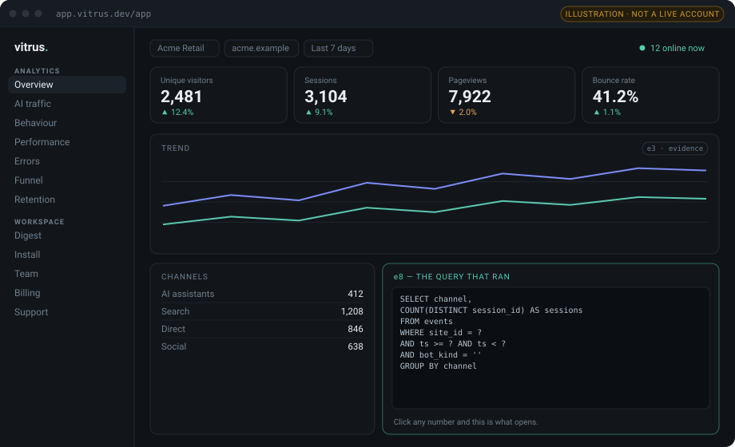

<div align="center">
  
  <h1>Vitrus</h1>
  <p><b>Analytics for the AI agent era.</b><br>
  Open source, cookie-free, and every number carries the query that produced it.</p>
  <p>
    <a href="https://vitrus.dev">Website</a> ·
    <a href="https://vitrus.dev/docs">Documentation</a> ·
    <a href="https://vitrus.dev/features">Features</a> ·
    <a href="https://vitrus.dev/changelog">Changelog</a> ·
    <a href="https://app.vitrus.dev">Cloud</a>
  </p>
  <p>
    
    
    
    
    <a href="https://github.com/Vitrus-Dev/vitrus/actions"></a>
  </p>
</div>

<div align="center">
  
</div>

---

Two things broke in web analytics at the same time.

**Measurement broke.** ChatGPT, Perplexity and Claude send you real visitors, and roughly **70% of
them land in GA4's "direct" bucket** because most assistants attach no campaign tag. Meanwhile GPTBot
and ClaudeBot read your pages every day, and most tools either ignore them or count them as people.

**Trust broke.** Analytics products now generate written summaries. A model that says "conversion
fell 12% because of the theme release" has produced two claims you cannot check: a number it may have
computed itself, and a cause it cannot possibly know.

Vitrus fixes both. It classifies AI traffic properly and separates the crawlers from the humans they
send you — and **it can prove every number it reports.** Click any figure in the dashboard and you get
the SQL that ran, the parameters it ran with, and the raw rows. If an AI-written sentence contains a
number that is not in the evidence, that sentence is dropped before it ever reaches you.

```
Visitors are down 18% against the previous period. [e1]
The drop coincides with the last deploy. [e1, e7]
✗ dropped: "The new theme caused a 41.7% fall in conversion."
   → 41.7 is in no evidence record, and "caused" is a claim we cannot make.
```

## Contents

- [Why Vitrus](#why-vitrus)
- [How it compares](#how-it-compares)
- [Quick start](#quick-start)
- [What it measures](#what-it-measures)
- [Privacy](#privacy)
- [Architecture](#architecture)
- [Running the tests](#running-the-tests)
- [Cloud](#cloud)
- [Community and support](#community-and-support)
- [Contributing](#contributing)

## Why Vitrus

|                                       | Vitrus                          | Typical tool        |
| ------------------------------------- | ------------------------------- | ------------------- |
| The query behind every number         | **Clickable, always**           | Not available       |
| AI referrals vs AI crawlers           | **Separate, never summed**      | Mixed or discarded  |
| Who an agent *proved* it was          | **Signature-checked, signer named** | User-agent only |
| Agent browser sessions                | **Their own class**             | Dropped, blocked or counted as a person |
| Bot detection layers                  | **Two, both open source**       | One, or the second is cloud-only |
| AI summaries                          | **Unprovable sentences dropped** | Shipped as written |
| Cookies / consent banner              | **None needed**                 | Usually required    |
| Tracker size                          | **2.4 KB gzipped**              | 12–28 KB            |
| Services to install                   | **Zero** (embedded database)    | Postgres, ClickHouse, Redis… |
| Runtime dependencies                  | **Zero**, enforced by CI        | Dozens              |

## How it compares

The open-source alternatives are good, several of them do things we do not, and this table exists to
help you pick rather than to win an argument. It is deliberately short: it lists only differences we
can state without qualification, because a comparison table full of half-checked cells is exactly the
kind of unverifiable claim this project was built to stop making.

*Checked 16 September 2026. These products ship quickly — if a cell is out of date, please
[open an issue](https://github.com/Vitrus-Dev/vitrus/issues/new) and we will correct it.*

| | GA4 | Plausible | Umami | Rybbit | Databuddy | **Vitrus** |
|---|---|---|---|---|---|---|
| Cookie-free, no consent banner | ✗ | ✓ | ✓ | ✓ | ✓ | **✓** |
| Self-hostable | ✗ | ✓ | ✓ | ✓ | ✓ | **✓** |
| Services to install | — | Postgres + ClickHouse | Postgres or MySQL | Postgres + ClickHouse | Postgres + ClickHouse + Redis | **none** |
| Tracker size | ~28 KB | ~1 KB | ~2 KB | ~18 KB | ~12 KB | **2.4 KB** |
| AI assistants as a channel | ✗ | ✓ | ✓ | ✓ | ✓ | **✓** |
| Crawler reads separated from the humans they send | ✗ | ✗ | ✗ | **✓** | ✗ | **✓** |
| **The query behind every number, in the UI** | ✗ | ✗ | ✗ | ✗ | ✗ | **✓** |
| **AI sentences dropped when the number is unprovable** | ✗ | ✗ | ✗ | ✗ | ✗ | **✓** |
| Verified agent identity (Web Bot Auth) | ✗ | ✗ | ✗ | ✗ | ✗ | **✓** |
| Agent browser sessions kept as their own class | ✗ | ✗ | ✗ | ✗ | ✗ | **✓** |
| Bot detection beyond the user-agent, in the open-source build | ✗ | ✗ | ✗ | ✗ | ✗ | **✓** |
| Session replay | ✗ | ✗ | **✓** | **✓** | ✗ | ✗ *(deliberate)* |
| Ad-platform attribution (ROAS) | **✓** | ✗ | ✗ | ✗ | ✗ | ✗ *(deliberate)* |
| City-level geography | **✓** | **✓** | **✓** | **✓** | **✓** | country only |
| Comfortable at hundreds of millions of events/month | **✓** | **✓** | **✓** | **✓** | **✓** | ~1M/month per box |

**When to pick something else.** If you need session replay or heatmaps, Umami and Rybbit have them
and we are not going to build either. If your reporting is tied to Google or Meta ad spend, GA4 is the only tool that closes that
loop. If you want feature flags and uptime checks in the same product, that is Databuddy. If city-level
geography matters, everyone else bundles a GeoIP database and we deliberately do not. And if you are
ingesting hundreds of millions of events a month, take a ClickHouse-backed tool — our embedded
database is what makes the zero-service install possible, and it is also its ceiling.

Note on the AI rows, corrected 16 September 2026: an earlier version of this table claimed that
nobody else separates the crawler that read you from the human it sent. That was wrong — Rybbit's
`/api/sites/:site/bots/ai-summary` does exactly this, per AI operator. Plausible, Umami, Rybbit and
Databuddy all group AI assistants as a traffic source too, and they do it well.

What is still ours: we report the crawler side **per page** rather than per operator, which is the
granularity GEO work actually needs — and, like every other number here, both halves carry the query
that produced them. We also do not draw a line between the two: "GPTBot read /pricing 84 times and 3
sessions arrived from ChatGPT on /pricing" is a coincidence in time, and the digest is forbidden from
calling it a cause.

The three agent rows were added 19 September 2026. On the last of them, to be specific rather than
smug: Plausible's *cloud* runs user-agent filtering plus datacentre IP ranges plus behavioural
analysis, and it is very likely better at this than we are. The claim is only about what ships in the
open-source build — its Community Edition has the user-agent filter alone, and our second layer is in
the Apache-2.0 core.

Longer write-ups, one per tool: [vitrus.dev/compare](https://vitrus.dev/compare).

## Quick start

```bash
bun install -g @vitrus/cli

vitrus init                                # creates ./vitrus.db and a secret salt
vitrus site add "My site" example.com      # prints your script tag
vitrus start                               # dashboard on :3000
```

Then add one line to your site:

```html
<script defer data-site="SITE_ID" src="http://localhost:3000/v.js"></script>
```

That is the entire install. No Docker Compose file, no second service, no migration step.

Want data on the screen straight away? `vitrus demo <site-id>` generates a realistic week.

## What it measures

**Traffic** — pageviews, sessions, unique visitors, live visitors, top pages, entry and exit pages,
referrers, channels, UTM campaigns, devices, browsers, operating systems, screen sizes, languages,
country (from your proxy's header).

**Behaviour** — custom events from code or from an HTML attribute, outbound clicks, form submissions,
field-level form abandonment, rage clicks, scroll depth, ordered funnels, retention cohorts.

**Health** — Core Web Vitals at p75 from real visits, slowest pages, JavaScript errors grouped by
message, page and browser.

**AI** — AI assistants as their own traffic channel, which pages AI crawlers are reading, and the gap
between the two.

**Agents** — signed requests verified against the Ed25519 key their operator publishes (Web Bot Auth,
over RFC 9421 HTTP Message Signatures), so the signer can be *named*; agent browser sessions counted
as their own class with their own funnel, rather than dropped, blocked or mistaken for people; and a
second detection layer that scores whether a request agrees with the browser its user-agent claims to
be. That last one is recorded and shown, never self-applying — see below.

**Filters and geography** — click any row to narrow every number on the page, compiled into the SQL
on the server rather than applied to rows in the browser, so the query you can read is the query that
produced the number. Visitors by country on a globe drawn from the built-in country table, with no
tile service and no third-party request.

**Control** — exclude your own visits, skip or mask private URLs in the browser, standard and strict
privacy modes, Slack/email/webhook digests, a REST API and a read-only MCP server.

All of it renders in the self-hosted dashboard — not only through the API. The open-core claim is
that no metric is held back from this repository, and a dashboard that showed six cards while the
documentation listed Web Vitals would make that claim look false to the one person who checked.

**A suspicion is not a verdict.** The second detection layer writes the rules that fired onto the
event (`bot_signals`, `bot_score`) and changes no number by itself. Traffic that looks automated is
still counted everywhere until you flip a switch; the switch is not remembered between visits, a
banner stays on screen while it is on, and the evidence panel shows the predicate doing the
excluding. A silent filter is indistinguishable, from your side, from a bug that loses traffic — so
"rather undercount than guess" cuts both ways, and we will not guess that someone is a robot either.

It is also not a fingerprint: no canvas, no font enumeration, no WebGL, no plugin list. Every rule
reads a header the client sent anyway, and a test fails the build if a fingerprinting surface ever
appears in that module. Known blind spots are written down rather than glossed: a headless browser
with stealth patches scores zero, and so does a residential-proxy botnet running real Chrome.

Deliberately absent: session replay and ad-platform attribution. [Here is why](https://vitrus.dev/docs/faq).

## Privacy

No cookies. No identifier stored in the browser. No fingerprinting.

The visitor id is a one-way hash:

```
sha256(secret_salt + "|" + day + "|" + site + "|" + ip_prefix + "|" + user_agent)
```

The salt rotates daily, so the same person becomes a different value tomorrow — cross-day tracking of
an anonymous visitor is not merely disallowed by policy, it is mathematically impossible. The IP is
never stored; it is only an input, and IPv6 is reduced to its /64 network prefix first. Do Not Track
is respected by default, not as an option you have to find.

This is also why the retention page tells you when it *cannot* compute a cohort instead of showing you
zeros. Call `vitrus.identify(user.id)` for logged-in users and retention becomes real.

## Architecture

```
packages/
  core      ingest · classifiers · MetricBundle · numeric guard · digest   (zero deps)
  tracker   the browser script, 2.4 KB gzipped                             (zero deps)
  server    one process: ingest + query API + tracker + dashboard          (zero deps)
  cli       init · site · start · digest · demo                            (zero deps)
  mcp       read-only MCP server for AI agents                             (zero deps)
```

Every metric is `{ id, sql, params, window, value }`. The SQL string *is* the evidence — it is not a
description of the query, it is the query. Hiding it behind an ORM would destroy the one thing this
product is for.

Numbers are computed by deterministic SQL first. The optional LLM layer (local Ollama, or your own
API key — neither is on by default) is handed the results and is forbidden from producing a number of
its own. A numeric guard checks every figure in the generated prose against the evidence set and drops
any sentence it cannot support.

## Running the tests

```bash
bun install
bun run build:tracker
bun run gates
```

`gates` runs the type checker, 315 tests, two golden-set evals and four build gates:

| Gate               | What it prevents                                                              |
| ------------------ | ----------------------------------------------------------------------------- |
| `eval:referrer`    | The AI classification table going stale unnoticed (100% required)             |
| `eval:insight`     | An unprovable number surviving into prose (zero leaks tolerated)              |
| `gate:tracker-size`| The tracker quietly growing and slowing your pages down                        |
| `gate:core-purity` | The metric layer ever importing the LLM layer                                  |
| `gate:no-deps`     | A runtime dependency appearing without a deliberate decision                    |
| `gate:inline-js`   | A bad escape killing the dashboard's script while the page still renders fine   |

That last one is not hypothetical. A single mis-escaped quote once took out every line of JavaScript
in the dashboard in production: the page drew perfectly and nothing worked, and every test passed,
because they all asked "is this text in the HTML" — and it was.

## Cloud

[app.vitrus.dev](https://app.vitrus.dev) is the hosted version: teams, roles, quotas, EU hosting and
digest delivery without running your own mail provider. The analysis engine is identical — **no
metric, funnel, cohort or evidence panel is held back from this repository**, and a build gate proves
the open core imports nothing commercial.

Self-hosting is free forever. [Self-host vs cloud](https://vitrus.dev/docs/self-host-vs-cloud).

## Community and support

- **Questions and ideas** — [GitHub Discussions](https://github.com/Vitrus-Dev/vitrus/discussions)
- **Bugs** — [open an issue](https://github.com/Vitrus-Dev/vitrus/issues/new). A failing case is worth
  more than a description; the AI referrer table in particular is tested by example.
- **Security** — [SECURITY.md](SECURITY.md). Please do not open a public issue for a vulnerability.
- **Cloud customers** — there is a support desk inside the dashboard. A ticket carries its workspace,
  so we can look at the same numbers you are looking at.

## Contributing

Issues and pull requests are welcome — see [CONTRIBUTING.md](CONTRIBUTING.md). The most useful
contribution is usually a new entry for the AI referrer table with a test case that pins it: the
classifier is only as current as the last assistant somebody taught it about.

## License

[Apache-2.0](LICENSE).
